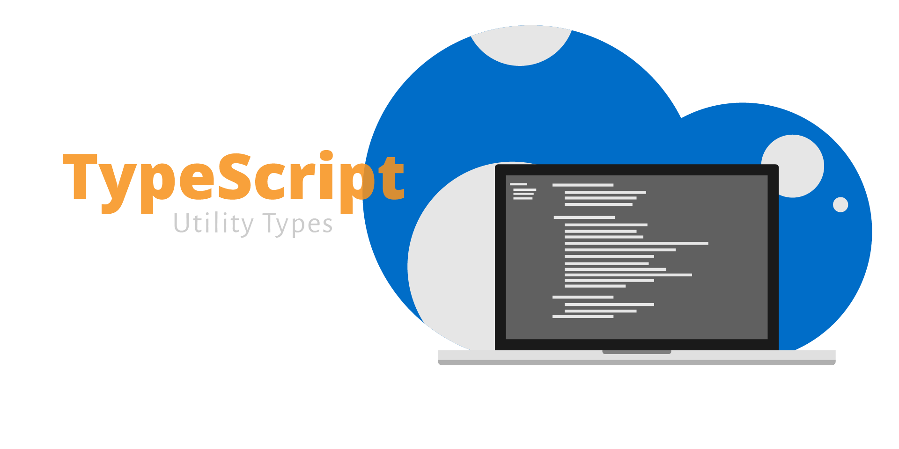

# TypeScript Utility Types

[](https://github.com/kylepillay/typescript-utility-types/actions/workflows/ci.yml)
[](https://coveralls.io/github/kylepillay/typescript-utility-types?branch=main)
[](https://github.com/kylepillay/typescript-utility-types/actions/workflows/security.yml)
[](https://github.com/kylepillay/typescript-utility-types/actions/workflows/codeql.yml)
[](https://www.npmjs.com/package/typescript-utility-types)
[](https://opensource.org/licenses/MIT)

A comprehensive collection of custom utility types for TypeScript projects.



## Installation

```bash
npm install typescript-utility-types
```

or (with yarn)

```bash
yarn add typescript-utility-types
```

## Usage

```typescript
import {
  Primitive,
  Falsy,
  Truthy,
  Nullish,
  NonNullableKeys,
  JSONObject,
  OptionalExceptFor,
  ReadonlyDeep,
  PartialDeep,
  Brand,
  // ... and many more
} from 'typescript-utility-types'
```

## Features

- **Comprehensive Collection**: Over 80+ utility types covering all major use cases
- **Inspired by Popular Libraries**: Incorporates the best types from [ts-toolbelt](https://github.com/millsp/ts-toolbelt), [type-fest](https://github.com/sindresorhus/type-fest), and [utility-types](https://github.com/piotrwitek/utility-types)
- **Type Safety**: Leverage TypeScript's power for robust and error-free code
- **Modular Design**: Easily import only the types you need
- **Well-tested**: Comprehensive test suite ensuring reliability
- **No Duplication**: Carefully curated to avoid conflicts with existing libraries

### Basic Types

- **Primitive**: Represents all basic JavaScript data types
- **Falsy**: Encompasses all falsy values in JavaScript
- **Truthy**: Filters out falsy values from type unions
- **Nullish**: Represents null or undefined values

### Object Manipulation Types

- **NonNullableKeys**: Extracts keys with non-nullish values
- **JSONObject**: Represents JSON-serializable objects
- **OptionalExceptFor**: Makes all properties optional except specified keys

### Deep Transformation Types

- **ReadonlyDeep**: Makes all nested properties readonly
- **PartialDeep**: Makes all nested properties partial

### Advanced Types

- **Awaited**: Extracts promise value types
- **Diff**: Finds difference between types
- **Intersection**: Creates intersection of types
- **Union**: Creates union of types
- **Complement**: Creates complement of types
- **SymmetricDiff**: Creates symmetric difference of types
- **RelativeComplement**: Creates relative complement
- **AbsoluteComplement**: Creates absolute complement
- **PowerSet**: Creates power set of types
- **CartesianProduct**: Creates cartesian product of types

### Function Utility Types

- **ReturnType**: Extracts function return types
- **Parameters**: Extracts function parameter types
- **OverrideReturnType**: Creates function with different return type

### Conditional Utility Types

- **If**: Conditional type selection
- **IsAssignable**: Checks type assignability
- **IsExact**: Checks exact type equality

### Array Utility Types

- **Head**: Gets first array element
- **Tail**: Gets all except first array element
- **Last**: Gets last array element
- **Init**: Gets all except last array element
- **Length**: Gets array length

### String Utility Types

- **Capitalize**: Capitalizes first letter
- **Uncapitalize**: Uncapitalizes first letter
- **Uppercase**: Converts to uppercase
- **Lowercase**: Converts to lowercase

## Examples

### Basic Usage

```typescript
import { Primitive, Falsy, Truthy, Nullish } from 'typescript-utility-types'

// Primitive types
const primitive: Primitive = 'string' // or number, boolean, null, undefined, etc.

// Falsy values
const falsy: Falsy = false // or '', 0, 0n, null, undefined

// Truthy filtering
type Filtered = Truthy<'' | 1 | false | {} | undefined> // Result: 1 | {}

// Nullish values
const nullish: Nullish = null // or undefined
```

### Object Manipulation

```typescript
import { NonNullableKeys, JSONObject, OptionalExceptFor } from 'typescript-utility-types'

interface User {
  id: number
  name: string
  email?: string
  age: number | null
}

// Extract non-nullish keys
type RequiredKeys = NonNullableKeys<User> // Result: 'id' | 'name'

// JSON serializable object
const json: JSONObject = {
  name: 'John',
  age: 30,
  active: true,
  data: null,
  nested: { value: 'test' }
}

// Make all optional except 'id'
type UserWithRequiredId = OptionalExceptFor<User, 'id'>
const user: UserWithRequiredId = { id: 1 } // Only id is required
```

### Deep Transformations

```typescript
import { ReadonlyDeep, PartialDeep } from 'typescript-utility-types'

interface NestedObject {
  value: string
  nested: {
    deep: number
    array: string[]
  }
}

// Make all nested properties readonly
type ReadonlyNested = ReadonlyDeep<NestedObject>

// Make all nested properties partial
type PartialNested = PartialDeep<NestedObject>
const partial: PartialNested = {
  nested: { deep: 42 } // Other properties are optional
}
```

### Brand Types

- **Brand**: Creates branded types for nominal typing

```typescript
import { Brand } from 'typescript-utility-types'

type UserId = Brand<number, 'UserId'>
type ProductId = Brand<number, 'ProductId'>

const userId: UserId = 123 as UserId
const productId: ProductId = 456 as ProductId

// These are different types even though they're both numbers
// userId = productId // Type error!
```

### Function Utilities

```typescript
import { ReturnType, Parameters, OverrideReturnType } from 'typescript-utility-types'

function createUser(name: string, age: number): { name: string; age: number } {
  return { name, age }
}

// Extract return type
type UserReturn = ReturnType<typeof createUser> // { name: string; age: number }

// Extract parameter types
type UserParams = Parameters<typeof createUser> // [string, number]

// Override return type
type UserCreator = OverrideReturnType<typeof createUser, Promise<UserReturn>>
```

### Array Utilities

```typescript
import { Head, Tail, Last, Init, Length } from 'typescript-utility-types'

type Numbers = [1, 2, 3, 4, 5]

type First = Head<Numbers> // 1
type Rest = Tail<Numbers> // [2, 3, 4, 5]
type LastNum = Last<Numbers> // 5
type AllButLast = Init<Numbers> // [1, 2, 3, 4]
type Count = Length<Numbers> // 5
```

### String Utilities

```typescript
import { Capitalize, Uncapitalize, Uppercase, Lowercase } from 'typescript-utility-types'

type Capitalized = Capitalize<'hello'> // 'Hello'
type Uncapitalized = Uncapitalize<'Hello'> // 'hello'
type Uppercased = Uppercase<'hello'> // 'HELLO'
type Lowercased = Lowercase<'HELLO'> // 'hello'
```

### Enhanced String Utilities

```typescript
import { StartsWith, EndsWith, Includes, Trim } from 'typescript-utility-types'

type StartsWithHello = StartsWith<'hello world', 'hello'> // true
type EndsWithWorld = EndsWith<'hello world', 'world'> // true
type IncludesWorld = Includes<'hello world', 'world'> // true
type Trimmed = Trim<'  hello world  '> // 'hello world'
```

### Type Guards and Validation

```typescript
import { IsNever, IsAny, IsFunction, IsPrimitive, IsObject, IsTuple, IsUnion, Equals } from 'typescript-utility-types'

type IsNeverType = IsNever<never> // true
type IsAnyType = IsAny<any> // true
type IsFunctionType = IsFunction<() => void> // true
type IsPrimitiveType = IsPrimitive<string> // true
type IsObjectType = IsObject<{ a: string }> // true
type IsTupleType = IsTuple<[string, number]> // true
type IsUnionType = IsUnion<string | number> // true
type AreEqual = Equals<string, string> // true
```

### Enhanced Object Utilities

```typescript
import { Required, Mutable, Pick, Omit, Keys, Values, RequireAtLeastOne } from 'typescript-utility-types'

interface User {
  id?: number
  name?: string
  email?: string
}

type RequiredUser = Required<User> // All properties required
type MutableUser = Mutable<Readonly<User>> // All properties mutable
type UserBasic = Pick<User, 'id' | 'name'> // Only id and name
type UserWithoutId = Omit<User, 'id'> // All properties except id
type UserKeys = Keys<User> // 'id' | 'name' | 'email'
type UserValues = Values<User> // number | string | undefined
type UserWithAtLeastOne = RequireAtLeastOne<User, 'name' | 'email'> // At least one required
```

### Enhanced Array Utilities

```typescript
import { First, Second, Third, IsEmpty, IsSingle, Reverse } from 'typescript-utility-types'

type Numbers = [1, 2, 3, 4, 5]
type FirstNum = First<Numbers> // 1
type SecondNum = Second<Numbers> // 2
type ThirdNum = Third<Numbers> // 3
type IsEmptyArray = IsEmpty<[]> // true
type IsSingleArray = IsSingle<[1]> // true
type Reversed = Reverse<Numbers> // [5, 4, 3, 2, 1]
```

### Enhanced Conditional Utilities

```typescript
import { IfElse, OrElse, IsAssignableTo } from 'typescript-utility-types'

type Conditional = IfElse<true, string, number> // string
type Fallback = OrElse<never, string> // string
type IsAssignable = IsAssignableTo<string, string | number> // true
```

### Enhanced Function Utilities

```typescript
import { FirstParameter, LastParameter, RestParameters, NoParameters } from 'typescript-utility-types'

function testFunc(a: string, b: number, c: boolean): string {
  return a
}

type FirstParam = FirstParameter<typeof testFunc> // string
type LastParam = LastParameter<typeof testFunc> // boolean
type RestParams = RestParameters<typeof testFunc> // [number, boolean]
type NoParamsFunc = NoParameters<typeof testFunc> // () => string
```

## 🛠️ Development

### Quick Start

```bash
# Clone and install dependencies
git clone <repository-url>
cd typescript-utility-types
npm install
```

### Available Scripts

| Command | Description |
|---------|-------------|
| `npm run build` | Build the library and generate type definitions |
| `npm test` | Run the test suite with coverage |
| `npm run test:watch` | Run tests in watch mode |
| `npm run lint` | Lint the codebase |
| `npm run start` | Start development mode with file watching |

### Development Workflow

1. **Make changes** to utility types in `src/library.ts`
2. **Add tests** in `test/library.test.ts`
3. **Run tests** to ensure everything works: `npm test`
4. **Build** the library: `npm run build`
5. **Commit** your changes with conventional commits

### Project Structure

```
src/
├── library.ts         # Main library with all utility types
test/
├── library.test.ts    # Test suite
dist/                  # Built files (generated)
├── types/             # TypeScript declaration files
└── lib/               # Compiled JavaScript
```

## Contributing

1. Fork the repository
2. Create your feature branch (`git checkout -b feature/amazing-feature`)
3. Commit your changes (`git commit -m 'Add some amazing feature'`)
4. Push to the branch (`git push origin feature/amazing-feature`)
5. Open a Pull Request

## License

MIT © Kyle Pillay

## Acknowledgments

- Built with [TypeScript Library Starter](https://github.com/alexjoverm/typescript-library-starter)
